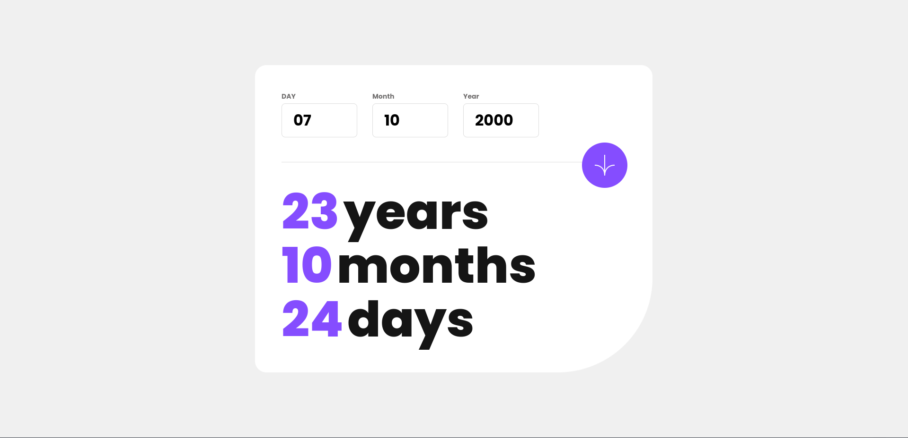

# Frontend Mentor - Age Calculator App Solution

This is a solution to the [Age Calculator App challenge on Frontend Mentor](https://www.frontendmentor.io/challenges/age-calculator-app-dF9DFFpj-Q). Frontend Mentor challenges help you improve your coding skills by building realistic projects.

## Table of Contents

- [Overview](#overview)
  - [The Challenge](#the-challenge)
  - [Screenshot](#screenshot)
  - [Links](#links)
- [My Process](#my-process)
  - [Built With](#built-with)
  - [What I Learned](#what-i-learned)
  - [Continued Development](#continued-development)
  - [Useful Resources](#useful-resources)
- [Author](#author)

## Overview

### The Challenge

Users should be able to:

- View an age in years, months, and days after submitting a valid date through the form.
- Users should not be able to input an incorrect date; if February 31 is entered, it should be corrected automatically.
- View the optimal layout for the interface depending on their device's screen size.
- See hover and focus states for all interactive elements on the page.

### Screenshot

### Links

- Solution URL: [GitHub Repository](https://github.com/TedJenkler/Age-calculator-typescript-scss-jest)
- Live Site URL: [Live Demo](https://age-calculator-typescript-scss-jest.netlify.app/)

## My Process

### Built With

- [Vite](https://vitejs.dev/) - A frontend build tool for fast development with a modern workflow.
- [React](https://reactjs.org/) - A JavaScript library for building user interfaces.
- [SCSS](https://sass-lang.com/documentation) - For advanced styling and creating flexible, maintainable stylesheets.
- [TypeScript](https://www.typescriptlang.org/docs) - For adding type safety and enhancing the development experience with static types.
- [Jest](https://jestjs.io/docs) - A testing framework for ensuring the correctness of JavaScript and TypeScript code with features like test runners, assertions, and mocking.

### What I Learned

During this project, I gained more experience in the following areas:

- **SCSS:** Enhanced understanding of SCSS features like mixins, maps, variables, and responsive design.
- **TypeScript:** Improved skills in TypeScript, including type definitions, interfaces, and generics for better type safety and code quality.
- **Jest:** Acquired proficiency in using Jest for testing JavaScript and TypeScript applications.

### Continued Development

- **Improving Accessibility:** Plan to enhance accessibility by incorporating best practices for SEO and ARIA (Accessible Rich Internet Applications) attributes to ensure the app is usable by everyone, including those using assistive technologies.

### Useful Resources

- [SCSS Documentation](https://sass-lang.com/documentation) - For comprehensive details on SCSS syntax and features.
- [TypeScript Documentation](https://www.typescriptlang.org/docs) - For learning TypeScript syntax, features, and best practices.
- [Vite Documentation](https://vitejs.dev/) - For understanding and configuring Vite as a build tool and development server.
- [Jest Documentation](https://jestjs.io/docs) - For learning how to use Jest for testing JavaScript and TypeScript applications, including setup, configuration, and best practices.

## Author

- Frontend Mentor - [@TedJenkler](https://www.frontendmentor.io/profile/TedJenkler)
- LinkedIn - [Teodor Jenkler](https://www.linkedin.com/in/tedjenklerwebdeveloper/)
- X - [@TJenkler](https://x.com/TJenkler)
- Discord - [TedJenkler](https://discord.com/users/TedJenkler)
- YouTube - [WebDevwithTed](https://www.youtube.com/@WebDevwithTed)